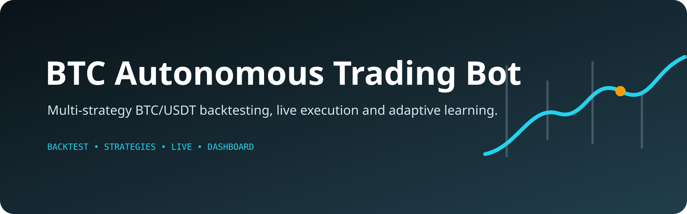

<p align="center">
  
</p>

# BTC Autonomous Trading Bot

Autonomous multi-strategy BTC/USDT trading bot with backtesting, live execution,
self-learning, and a real-time Dash dashboard.

---

## Features

| Feature | Detail |
|---|---|
| Strategies | 5 independent strategies (RSI+BB, MACD, EMA Cross, Breakout, ML Adaptive) |
| Backtesting | 500-day walk-forward test; only strategies ≥50% CAGR are activated |
| Execution | Binance REST API (Spot); Testnet by default |
| Self-learning | RandomForest model trained on closed trades; parameter auto-tuning |
| Dashboard | Dash app: equity curve, positions, trade history, journal |
| Capital | Starts with $10,000 split equally across active strategies |

---

## Quick Start

### 1. Install dependencies

```bash
cd btc_trading_bot
pip install -r requirements.txt
```

### 2. Configure API keys

```bash
cp .env.example .env
# Edit .env with your Binance API keys
# Leave USE_TESTNET=true until you're confident
```

Get **Testnet** keys (free, no real funds) at:
https://testnet.binance.vision/

### 3. Run backtest only (recommended first step)

```bash
python run_backtest_only.py
```

This prints a summary table and saves `backtest_results.html` with equity curves.

### 4. Start the full bot + dashboard

```bash
python main.py
```

Dashboard opens at: **http://localhost:8050**

---

## Architecture

```
main.py                  ← Orchestrator; launches all threads
├── backtester.py        ← 500-day vectorised backtest
├── portfolio_manager.py ← Position sizing, order execution, SL/TP
├── learning_engine.py   ← ML training, param tuning, journal entries
├── binance_client.py    ← Binance REST wrapper (demo fallback)
├── strategies/
│   ├── rsi_bollinger.py ← Mean-reversion (RSI + Bollinger Bands)
│   ├── macd_momentum.py ← Trend-following (MACD crossover)
│   ├── ema_crossover.py ← Golden/Death cross (EMA 9/21)
│   ├── breakout.py      ← Volume-confirmed price breakouts
│   └── ml_adaptive.py   ← RandomForest trained on live trade history
├── dashboard/app.py     ← Dash web dashboard (port 8050)
├── database.py          ← SQLite persistence layer
└── utils/indicators.py  ← Technical indicator calculations (ta library)
```

---

## Dashboard Tabs

1. **Portfolio Overview** – Total balance, equity curve, drawdown, capital allocation pie
2. **Strategy Performance** – Per-strategy metrics table + individual equity curves
3. **Open Positions** – Live table with unrealized P&L (refreshes every 15 s)
4. **Trade History** – Filterable/sortable trade log + cumulative P&L + P&L histogram
5. **Trade Journal** – Per-trade entries with setup description, outcome analysis,
   machine-generated reflection, and lessons learned

---

## Self-Improvement Mechanism

After each closed trade:
1. **Feature vector** extracted (RSI, BB%, MACD histogram, volume ratio, ADX, ATR, EMA alignment, etc.)
2. **Outcome** (win=1 / loss=0) recorded with trade ID
3. **ML_Adaptive** strategy retrains a `RandomForestClassifier` every 10 new samples
4. **Classifier confidence** is used to scale position size (higher confidence → larger position)
5. **Parameter tuning**: if recent 20-trade win rate drops below 38%, strategy parameters
   are nudged (e.g., RSI thresholds tightened, volume multiplier raised)
6. **Journal entry** generated with reflection text and lessons

---

## Risk Management

- Stop-loss: 2.5% per trade (ATR-based for MACD and EMA strategies)
- Take-profit: 5.5% per trade (3–4× ATR for some strategies)
- Max position size: 40% of strategy capital
- Max drawdown guard: pauses new entries if strategy drops 20% from peak
- ML confidence filter: skips trades below 42% predicted win probability
- Max 2 simultaneous positions per strategy

---

## Demo Mode

If no Binance API keys are provided the bot runs in **demo mode**:
- Price data is generated via Geometric Brownian Motion (realistic BTC dynamics)
- Orders are simulated locally with Binance-equivalent fees (0.1%)
- All other features (dashboard, learning, journal) function identically

---

## Disclaimer

This software is for educational purposes. Cryptocurrency trading involves
significant financial risk. Past performance (including backtested results)
does not guarantee future returns. Never trade with funds you cannot afford to lose.
Always start with testnet before enabling live trading.
